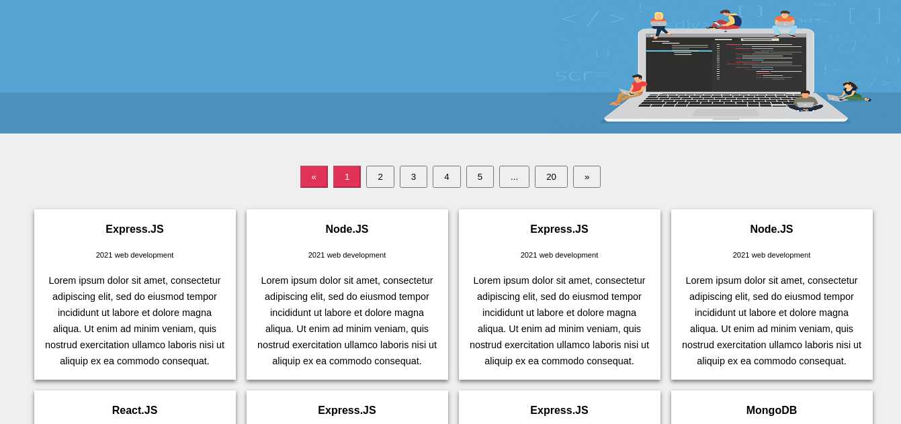
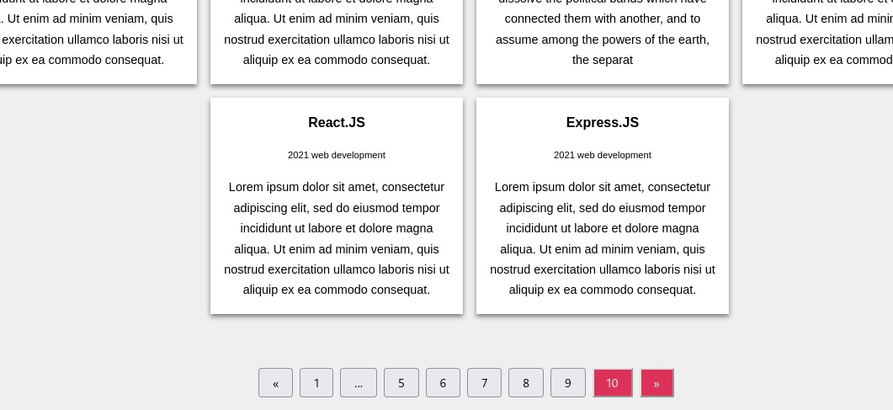

# Dynamic Pagination



## Introduction

Simple app created to practic how to implement a dynamic pagination in front and back, using MERN stack
- React.js && Node.js && Mongo



## Deploy on Heroku: https://pagination-back-front.herokuapp.com/

Setup:
- run ```npm i && npm start``` for both client and server side to start the app